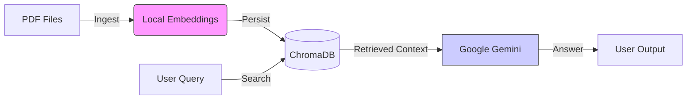

# 🤖 AI RAG Assignment: Hybrid Retrieval-Augmented Generation


A professional, modular RAG system built with **Python 3.10**, **LangChain**, and **ChromaDB**.

This project implements a **Hybrid Architecture** that combines the reasoning power of **Google Gemini** (Cloud) with the speed and privacy of **HuggingFace Embeddings** (Local/CPU).

---

## 🛠 Tech Stack

* **Orchestration:** LangChain
* **LLM Support:** Google Gemini (1.5 / 2.5), OpenAI GPT-4o
* **Embedding Support:** HuggingFace (Local), Google GenAI, OpenAI
* **Vector Database:** ChromaDB (Local)
* **Configuration:** Pydantic Settings
* **Quality Control:** Ruff, Pre-commit

---

## 🌟 Key Features

* **Hybrid RAG Architecture:**
    * 🧠 **Brain:** Cloud LLM (Google Gemini / OpenAI).
    * 📚 **Memory:** Local Embeddings (`all-MiniLM-L6-v2`) for zero-latency, free retrieval.
* **Factory Pattern Design:** Easily switch between OpenAI, Google, or Local models via configuration.
* **Robust Ingestion Pipeline:** Auto-cleans database on schema changes to prevent dimension mismatch errors.
* **Developer Friendly:** Includes a `Makefile` for one-command execution and Type-safe configuration.

---

## 📂 Project Structure

```text
ai_rag_assignment/
├── data/
│   ├── raw/                 # Drop your PDFs here
│   └── vector_store/        # Auto-generated ChromaDB files (Git-ignored)
├── src/
│   ├── ingestion/           # Document loading & splitting logic
│   ├── retrieval/           # Vector DB & Embedding factory
│   ├── generation/          # LLM interface (Gemini/OpenAI)
│   ├── config.py            # Centralized settings management
│   └── main.py              # CLI Entry point
├── environment.yml          # Conda environment definition
├── Makefile                 # Shortcut commands
└── README.md                # Project documentation

```

---

## 🚀 Setup & Installation

### 1. Prerequisites

* **Conda** (Anaconda or Miniconda)
* A **Google Gemini API Key** (Get it from [Google AI Studio](https://aistudio.google.com/))

### 2. Clone & Environment

```bash
# Clone the repository
git clone <your-repo-url>
cd ai_rag_assignment

# Create and activate the Conda environment
conda env update --file environment.yml --prune
conda activate ai_rag_assignment

```

### 3. Configuration (.env)

Create a `.env` file in the root directory:

```ini
# .env file

# --- API Keys ---
GOOGLE_API_KEY=your_actual_api_key_here

# --- Model Selection ---
# Use the model version available to your API key (e.g., gemini-1.5-flash or gemini-2.5-flash)
GOOGLE_MODEL_NAME=gemini-2.5-flash

# --- Architecture Settings ---
LLM_PROVIDER=google
EMBEDDING_PROVIDER=huggingface
VECTOR_DB_TYPE=chroma

# --- Ingestion Settings ---
CHUNK_SIZE=1000
CHUNK_OVERLAP=200

```

---

## 🏃 Usage

### 1. Ingest Documents

Place your PDF files into the `data/raw/` folder. Then run:

```bash
make ingest

```

* **What this does:**
1. Loads PDFs from `data/raw`.
2. Splits them into 1000-character chunks.
3. Generates embeddings locally (using your CPU).
4. Saves them to `data/vector_store`.


### 2. Query the System

Ask a question about your documents:

```bash
make query Q="What is the project code mentioned in the document?"

```

* **What this does:**
1. Searches the local database for relevant chunks.
2. Sends the chunks + your question to the LLM.
3. Returns a grounded, accurate answer.


---

## 🛠 Troubleshooting

**Error: `429 Resource Exhausted**`

* **Cause:** Google's free tier embedding quota is empty.
* **Fix:** Ensure `EMBEDDING_PROVIDER=huggingface` is set in your `.env`. This forces the app to use local, free embeddings.

**Error: `404 Not Found (models/gemini-...)**`

* **Cause:** The model name in `.env` doesn't match what your API key allows (e.g., requesting `gemini-1.5` when your key is on a `gemini-2.5` beta tier).
* **Fix:** Check your available models in Google AI Studio and update `GOOGLE_MODEL_NAME` in your `.env` to match exactly.

---

## 🏗 Architecture



---

## 📝 License

This project is intended for educational and assessment purposes.

```

### Next Step
You are all set! Copy this content into your `README.md`, commit your changes, and you are ready for tomorrow. Good luck with the assignment!

```